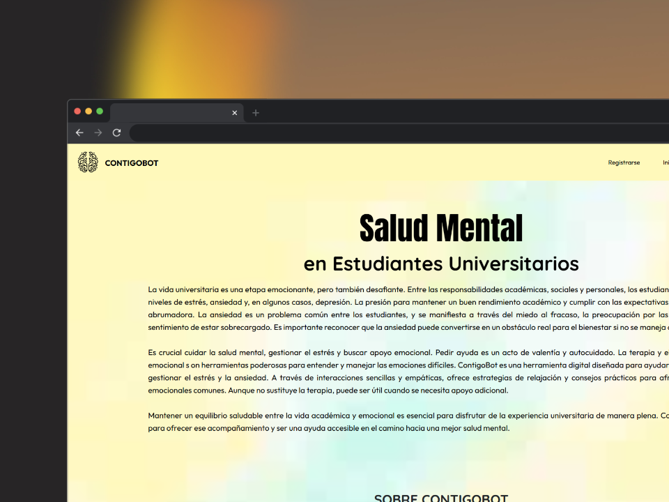

# Descripción del Proyecto
ContigoBot es una plataforma web diseñada para ofrecer apoyo emocional y bienestar psicológico a estudiantes universitarios. A través de un chatbot impulsado por inteligencia artificial, los estudiantes pueden acceder a recursos y consejos para manejar problemas comunes como el estrés, la ansiedad y la depresión. El proyecto se centra en proporcionar una herramienta accesible, segura y efectiva para ayudar a los estudiantes a enfrentar los desafíos emocionales de la vida universitaria.

## 🚀 Estructura del Proyecto

Dentro de su proyecto Astro, verá las siguientes carpetas y archivos:

```text
/
├── public/
│   └── favicon.svg
├── src/
│   ├── components/
│   │   └── Card.astro
│   ├── layouts/
│   │   └── Layout.astro
│   └── pages/
│       └── index.astro
└── package.json
```

# Arquitectura del Proyecto

ContigoBot está construido utilizando una arquitectura mixta de cloud y cliente-servidor, aprovechando las ventajas de ambos enfoques para ofrecer un sistema ágil y escalable. En este modelo, Firebase actúa como el servidor, proporcionando funcionalidades de backend como el almacenamiento de datos y la gestión de usuarios, mientras que Vercel se encarga del cliente, ofreciendo un entorno de despliegue rápido y eficiente para las interfaces de usuario y el frontend.

Esta combinación permite que el sistema sea flexible, escalable y altamente disponible, ya que cada componente puede operar de forma independiente y aprovechar las capacidades específicas de cada plataforma. Además, esta arquitectura asegura una experiencia de usuario fluida y segura, garantizando que el sistema pueda crecer y adaptarse a futuras necesidades sin comprometer el rendimiento.

# Impacto Esperado

ContigoBot está diseñado para tener un impacto significativo en el bienestar emocional de los estudiantes universitarios. Al proporcionar un acceso fácil y anónimo a apoyo emocional, el chatbot ayuda a reducir el estigma asociado con la búsqueda de ayuda psicológica. Se espera que su uso disminuya los niveles de estrés, ansiedad y depresión entre los estudiantes, mejorando así su calidad de vida y su rendimiento académico. Al ofrecer recursos y consejos personalizados, ContigoBot empodera a los estudiantes para que enfrenten los desafíos emocionales de la vida universitaria con mayor resiliencia.

## 🧞 Commands

Todos los comandos de la terminal que se pueden ejecutar en el entorno de astro:

| Command                   | Action                                           |
| :------------------------ | :----------------------------------------------- |
| `npm install`             | Instala dependencias                            |
| `npm run dev`             | Inicia el servidor de desarrollo local en `localhost:4321`|
| `npm run build`           | Construya su sitio de producción en `./dist/`    |
| `npm run preview`         | Obtenga una vista previa de su compilación localmente, antes de implementarla    |
| `npm run astro ...`       | Ejecute comandos CLI como `astro add`, `astro check` |
| `npm run astro -- --help` | Obtenga ayuda para usar Astro CLI                    |

### 
[](https://astro.build)
